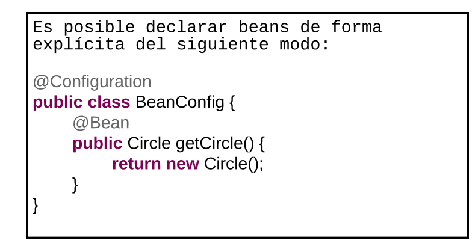

- QUe pasa si no tengo acceso al codigo solo al jar no puedo colocarle la notacion
- Spring @Bean es una de las anotaciones que más se usa en Spring Framework .
Normalmente nos sirve para configurar beans a medida. Es decir beans que necesitamos instanciar con alguna configuración por defecto.
Normalmente cuando generamos Servicios o Repositorios estos no tienen grandes configuraciones que asociar ya que 
vienen dadas por el application.properties que es el fichero que configura todo por defecto a nivel de Spring Boot sin 
embargo hay ocasiones que algunos beans que puede ser necesario realizar una configuración a medida para luego usarlos 
en Servicios o Controllers como clases de apoyo
- 