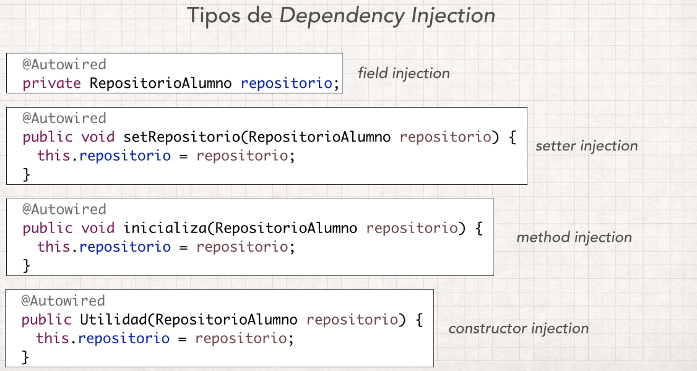

- Los beans son los componentes
- La dependencia es cuando dos componentes se relacionan
- El aplication context es cuando los beans resuelven sus depedencias
- component scan busca todos los componentes que tengan la anotacion
- @Controller componente para atender peticiones web
- @Service componente con la logica de negocio
- @Repository componente de acceso a datos
- @Configuration Componente que participara en la construccion del aplicacion context
- @Autowired buscara un bean(componente) del tipo indicado en el aplication context y lo asignara a la variable
- Usos de autowired 