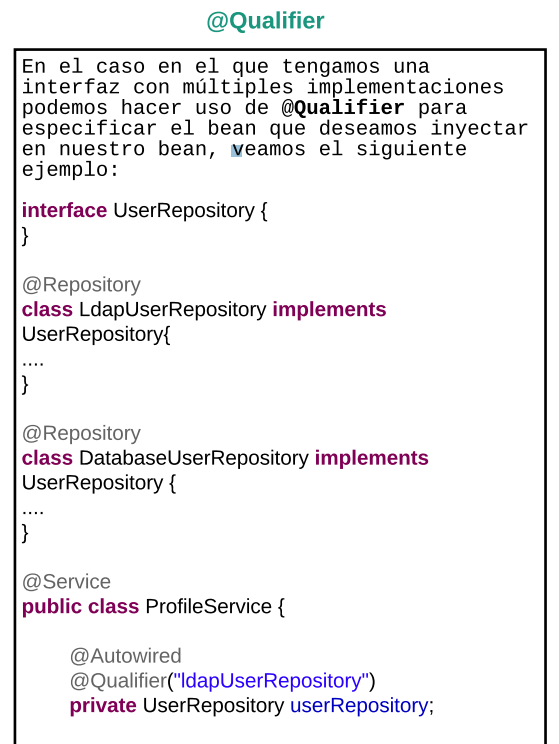

- Supongamos que hay varias implementaciones de animal, cuando intento traer la clase animal (es abstracta y tiene dos implementaciones)
que tengo que definir a cual hace referencia.
- El valor de qualifier se importa con la primera letra en minisculas
- 

